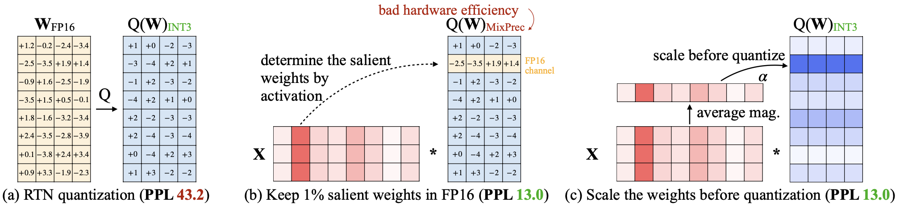
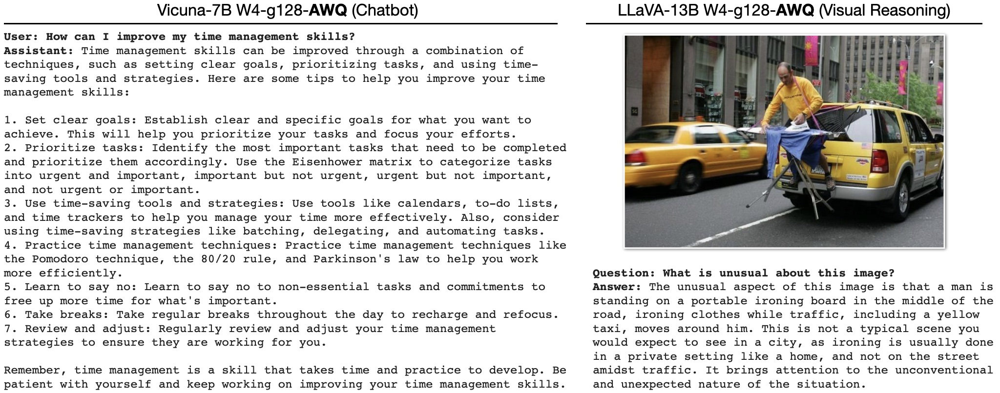

# AWQ: Activation-aware Weight Quantization for LLM Compression and Acceleration 
[[Paper](https://arxiv.org/abs/2306.00978)][[Website](https://hanlab.mit.edu/projects/awq)]

**Efficient and accurate** low-bit weight quantization (INT3/4) for LLMs, supporting **instruction-tuned** models and **multi-modal** LMs.



The current release supports: 

- AWQ search for accurate quantization. 
- Pre-computed AWQ model zoo for LLMs (Llama-1/2/3, OPT, CodeLlama, StarCoder, Vicuna, VILA, LLaVA; load to generate quantized weights).
- Memory-efficient 4-bit Linear in PyTorch.
- Efficient CUDA kernel implementation for fast inference (support context and decoding stage).
- Examples on 4-bit inference of an instruction-tuned model (Vicuna) and **multi-modal LM** (VILA).
- Chunk prefilling for faster prefilling in multi-round Q&A setting.
- State-of-the-art prefilling speed of LLMs/VLMs on edge devices: [TinyChat 2.0](./tinychat).

**Thanks to AWQ, TinyChat can deliver more efficient responses with LLM/VLM chatbots through 4-bit inference.**

* TinyChat with LLaMA-3-8b on RTX 4090 (2.7x faster than FP16):


* TinyChat with LLaMA-3-8b on Jetson Orin (2.9x faster than FP16):


**TinyChat also supports inference with vision language models (e.g., VILA, LLaVA). In the following examples, W4A16 quantized models from VILA family are launched with TinyChat.**

* TinyChat with NVILA-8B on RTX 4090 (single-image inputs):


* TinyChat with NVILA-8B on RTX 4090 (multi-image inputs):


<!-- Check out [TinyChat](tinychat), which delievers **30 tokens/second** inference performance (**3.2x faster** than FP16) for the **Llama2** chatbot on the resource-constrained NVIDIA Jetson Orin!  -->

* TinyChat with video reasoning:

https://github.com/user-attachments/assets/b68a7a0d-5175-4030-985b-5ae0ae94f874

**Prompt:** What might be the next step according to the video?

**Answer:** The next step in the video could be to place the shaped dough onto a baking sheet and let it rise before baking.

**Online demo:** https://vila.hanlab.ai

Check out [TinyChat](tinychat), which offers a turn-key solution for **on-device inference** of LLMs and VLMs on **resource-constrained edge platforms**. With TinyChat, it is now possible to efficiently run **large** models on **small** and **low-power** devices even without Internet connection!


## News
- [2025/04] 🔥 AWQ now supports DeepSeek-R1-Distilled models. Try our example [here](https://github.com/mit-han-lab/llm-awq/blob/main/scripts/DeepSeek_R1_Distill_example.sh)!
- [2025/02] AWQ now supports BF16 precision. See example [here](https://github.com/mit-han-lab/llm-awq/blob/main/scripts/qwen_example.sh).
- [2024/10] 🔥⚡ Explore advancements in [TinyChat 2.0](./tinychat), the latest version with significant advancements in prefilling speed of Edge LLMs and VLMs, **1.5-1.7x** faster than the previous version of TinyChat. Please refer to the [README](./tinychat/README.md) and [blog](https://hanlab.mit.edu/blog/tinychat20) for more details. 
- [2024/05] 🏆 AWQ receives the **Best Paper Award** at **MLSys 2024**. 🎉 
- [2024/05] 🔥 The **VILA-1.5** model family which features **video understanding** is now supported in AWQ and TinyChat. Check out out online demo powered by TinyChat [here](https://vila.hanlab.ai). Example is [here](scripts/vila15_example.sh).
- [2024/05] 🔥 [AMD](https://community.amd.com/t5/ai/reduce-memory-footprint-and-improve-performance-running-llms-on/ba-p/686157) adopts AWQ to improve LLM serving efficiency.
- [2024/04] 🔥 We released AWQ and TinyChat support for The **Llama-3** model family! Check out our example [here](scripts/llama3_example.sh).
- [2024/02] 🔥 AWQ has been accepted to **MLSys 2024**!
- [2024/02] 🔥 We supported [VILA Vision Languague Models](https://arxiv.org/abs/2312.07533) in AWQ & TinyChat! Check our latest demos with multi-image inputs!
- [2024/02] 🔥 We released new version of quantized GEMM/GEMV kernels in [**TinyChat**](tinychat), leading to **38 tokens/second** inference speed on NVIDIA Jetson Orin!
- [2024/01] 🔥 AWQ has been integrated by [Google Vertex AI](https://console.cloud.google.com/vertex-ai/publishers/meta/model-garden/llama-2-quantized)!
- [2023/11] 🔥 AWQ has been integrated by [Amazon Sagemaker Containers](https://aws.amazon.com/blogs/machine-learning/boost-inference-performance-for-llms-with-new-amazon-sagemaker-containers/)!
- [2023/11] 🔥 We added AWQ support and pre-computed search results for CodeLlama, StarCoder, StableCode models. Checkout our model zoo [here](https://huggingface.co/datasets/mit-han-lab/awq-model-zoo)!
- [2023/11] 🔥 AWQ is now integrated natively in Hugging Face transformers through `from_pretrained`. You can either load quantized models from the Hub or your own HF quantized models.
- [2023/10] AWQ is integrated into NVIDIA [TensorRT-LLM](https://github.com/NVIDIA/TensorRT-LLM/)
- [2023/09] AWQ is integrated into [Intel Neural Compressor](https://github.com/intel/neural-compressor), [FastChat](https://github.com/lm-sys/FastChat/blob/main/docs/awq.md), [vLLM](https://github.com/vllm-project/vllm/blob/main/vllm/model_executor/layers/quantization/awq.py), [HuggingFace TGI](https://github.com/huggingface/text-generation-inference/pull/1054), and [LMDeploy](https://github.com/InternLM/lmdeploy). 
- [2023/09] ⚡ Check out our latest [**TinyChat**](tinychat), which is ~2x faster than the first release on Orin!
- [2023/09] ⚡ Check out [**AutoAWQ**](https://github.com/casper-hansen/AutoAWQ), a third-party implementation to make AWQ easier to expand to new models, improve inference speed, and integrate into Huggingface.
- [2023/07] 🔥 We released **TinyChat**, an efficient and lightweight chatbot interface based on AWQ. TinyChat enables efficient LLM inference on both cloud and edge GPUs. Llama-2-chat models are supported! Check out our implementation [here](tinychat).
- [2023/07] 🔥 We added AWQ support and pre-computed search results for Llama-2 models (7B & 13B). Checkout our model zoo [here](https://huggingface.co/datasets/mit-han-lab/awq-model-zoo)!
- [2023/07] We extended the support for more LLM models including MPT, Falcon, and BLOOM. 

## Contents

- [AWQ: Activation-aware Weight Quantization for LLM Compression and Acceleration](#awq-activation-aware-weight-quantization-for-llm-compression-and-acceleration)
  - [News](#news)
  - [Contents](#contents)
  - [Helpful Links](#helpful-links)
  - [Install](#install)
  - [AWQ Model Zoo](#awq-model-zoo)
  - [Examples](#examples)
  - [Usage](#usage)
  - [Results on Visual Language Models](#results-on-visual-language-models)
  - [Reference](#reference)
  - [Related Projects](#related-projects)

## Helpful Links

- [VILA online demo](vila.hanlab.ai): Visual Language Models efficiently supported by AWQ & TinyChat.
- [LLM on the Edge](https://github.com/mit-han-lab/llm-awq/tree/nv_laptop?tab=readme-ov-file#install): AWQ and TinyChat support edge GPUs such as NVIDIA Jetson Orin.
- [VLMs on Laptop](https://github.com/mit-han-lab/llm-awq/tree/nv_laptop?tab=readme-ov-file#run-vila-on-laptop): Follow the instructions to deploy VLMs on NVIDIA Laptops with TinyChat.
- [Gradio Server](https://github.com/mit-han-lab/llm-awq/tree/nv_laptop/tinychat/serve#gradio-demo-vila-with-tinychat): Try to build your own VLM online demo with AWQ and TinyChat!
- [QServe](https://github.com/mit-han-lab/qserve): 🔥 **[New]** Efficient and accurate serving system for large-scale LLM inference.
  
## Install

1. Clone this repository and navigate to AWQ folder
```
git clone https://github.com/mit-han-lab/llm-awq
cd llm-awq
```

2. Install Package
```
conda create -n awq python=3.10 -y
conda activate awq
pip install --upgrade pip  # enable PEP 660 support
pip install -e .
```

* For **edge devices** like Orin, before running the commands above, please:

    1. Modify [pyproject.toml](pyproject.toml) by commenting out [this line](https://github.com/mit-han-lab/llm-awq/blob/3fce69061682fdd528824e5da3d03a8a8b545f2a/pyproject.toml#L17).
    2. Manually install precompiled PyTorch binaries (>=2.0.0) from [NVIDIA](https://forums.developer.nvidia.com/t/pytorch-for-jetson/72048). You also need to install torchvision from this website when running NVILA.
    3. Set the appropriate Python version for conda environment (e.g., `conda create -n awq python=3.8 -y` for JetPack 5).
  
3. Install efficient W4A16 (4-bit weight, 16-bit activation) CUDA kernel and optimized FP16 kernels (e.g. layernorm, positional encodings).
```
cd awq/kernels
python setup.py install
```

4. Install Flash Attention
```
pip install flash-attn --no-build-isolation
```

We recommend starting an interactive python CLI interface and run `import flash_attn` to check whether FlashAttention-2 is installed successfully. If not, we recommend downloading pre-built wheels from [here](https://github.com/Dao-AILab/flash-attention/releases/tag/v2.5.8). Please notice:

- PyTorch version needs to exactly match with the version specified in the `.whl` name;
- Check out both `cxx11abiTRUE` and `cxx11abiFALSE` wheels if one of them does not work;
- It's recommended to match CUDA version specified in the `.whl` filename, but minor mismatches (e.g. 12.1 vs 12.2, or even 11.8 vs 12.2) usually do not matter.


5. [Optional] In order to run AWQ and TinyChat with NVILA model family, please install VILA:

```bash
git clone https://github.com/NVlabs/VILA.git
cd VILA
pip install -e .
```

## AWQ Model Zoo

We provide pre-computed AWQ search results for multiple model families, including LLaMA, OPT, Vicuna, and LLaVA. To get the pre-computed AWQ search results, run:

```bash
# git lfs install  # install git lfs if not already
git clone https://huggingface.co/datasets/mit-han-lab/awq-model-zoo awq_cache
```

The detailed support list:

| Models | Sizes                       | INT4-g128 | INT3-g128 |
| ------ | --------------------------- | --------- | --------- |
| [DeepSeek-R1-Distill](/scripts/DeepSeek_R1_Distill_example.sh) | 1.5B/7B/8B |  ✅         |         |
| [Qwen-2.5](/scripts/qwen_example.sh) | 7B/72B            | ✅         |          |
| [NVILA](/scripts/nvila_example.sh) | 3B/8B |  ✅         |         |
| [VILA-1.5](/scripts/vila15_example.sh)  | 3B/8B/13B/40B  | ✅         | ✅        |
| [Llama3](/scripts/llama_example.sh)  | 8B/70B  | ✅         | ✅        |
| [VILA](/scripts/vila_example.sh)    | 7B/13B                     | ✅         |           |
| [Llama2](/scripts/llama_example.sh)  | 7B/13B/70B  | ✅         | ✅        |
| [LLaMA](/scripts/llama2_example.sh)  | 7B/13B/30B/65B              | ✅         | ✅        |
| [OPT](/scripts/opt_example.sh)    | 125m/1.3B/2.7B/6.7B/13B/30B | ✅         | ✅        |
| [CodeLlama](/scripts/codellama_example.sh) | 7B/13B/34B               | ✅         | ✅        |
| [StarCoder](/scripts/starcoder_example.sh) | 15.5B                    | ✅         | ✅        |
| [Vicuna-v1.1](/scripts/vicuna_example.sh) | 7B/13B                 | ✅         |           |
| [LLaVA-v0](/scripts/llava_example.sh) | 13B                       | ✅         |           |

Note: We only list models that we have prepare the [AWQ searching results](https://huggingface.co/datasets/mit-han-lab/awq-model-zoo/tree/main) in the table above. AWQ also supports models such as LLaVA-v1.5 7B, and you may need to run the [AWQ search](#usage) on your own to quantize these models. For our latest VLM NVILA, quantized weights are available [here](https://huggingface.co/Efficient-Large-Model/NVILA-AWQ).

## Examples

AWQ can be easily applied to various LMs thanks to its good generalization, including instruction-tuned models and multi-modal LMs. It provides an easy-to-use tool to reduce the serving cost of LLMs.

Here we provide two examples of AWQ application: Vicuna-7B (chatbot) and LLaVA-13B (visual reasoning) under `./examples` directory. AWQ can easily reduce the GPU memory of model serving and speed up token generation. It provides accurate quantization, providing reasoning outputs. You should be able to observe **memory savings** when running the models with 4-bit weights. 

Note that we perform AWQ using only textual calibration data, depsite we are running on multi-modal input. Please refer to `./examples` for details.



## Usage

We provide several sample script to run AWQ (please refer to `./scripts`). We use Llama3-8B as an example.

1. Perform AWQ search and save search results (we already did it for you):
```bash
python -m awq.entry --model_path /PATH/TO/LLAMA3/llama3-8b \
    --w_bit 4 --q_group_size 128 \
    --run_awq --dump_awq awq_cache/llama3-8b-w4-g128.pt
```

2. Evaluate the AWQ quantized model on WikiText-2 (simulated pseudo quantization)
```bash
python -m awq.entry --model_path /PATH/TO/LLAMA3/llama3-8b \
    --tasks wikitext \
    --w_bit 4 --q_group_size 128 \
    --load_awq awq_cache/llama3-8b-w4-g128.pt \
    --q_backend fake
```

3. Generate real quantized weights (INT4)
```bash
mkdir quant_cache
python -m awq.entry --model_path /PATH/TO/LLAMA3/llama3-8b \
    --w_bit 4 --q_group_size 128 \
    --load_awq awq_cache/llama3-8b-w4-g128.pt \
    --q_backend real --dump_quant quant_cache/llama3-8b-w4-g128-awq.pt
```

4. Load and evaluate the real quantized model (now you can see smaller gpu memory usage)
```bash
python -m awq.entry --model_path /PATH/TO/LLAMA3/llama3-8b \
    --tasks wikitext \
    --w_bit 4 --q_group_size 128 \
    --load_quant quant_cache/llama3-8b-w4-g128-awq.pt
```
## Results on Visual Language Models

AWQ also seamlessly supports large multi-modal models (LMMs). Please refer to [TinyChat](./tinychat/README.md) for more details.


<!-- AWQ also seamlessly supports large multi-modal models (LMMs). We demonstrate the results on the recent [VILA-1.5](https://github.com/Efficient-Large-Model/VILA) model family. -->

<!-- 
| VILA-1.5-3B   | VQA-v2            | GQA               | VizWiz  | ScienceQA         | TextVQA           | POPE    | MME     | MMBench           | MMBench-CN    | SEED    |
| ----------- |:-----------------:|:-----------------:|:-------:|:-----------------:|:-----------------:|:-------:|:-------:|:-----------------:|:-------------:|:-------:|
| FP16        | 80.4  | 61.5 | 53.5   | 69.0  | 60.4  | 85.9 | 1442.4 | 63.4 | 52.7   | 60.9 |
| AWQ-INT4    | 80.0  | 61.1 | 53.8   | 67.8  | 60.4  | 85.9 | 1437.3 | 63.3 | 51.4   | 59.8 | 

| VILA-1.5-8B    | VQA-v2            | GQA               | VizWiz  | ScienceQA         | TextVQA           | POPE    | MME     | MMBench           | MMBench-CN    | SEED    |
| ----------- |:-----------------:|:-----------------:|:-------:|:-----------------:|:-----------------:|:-------:|:-------:|:-----------------:|:-------------:|:-------:|
| FP16        | 80.9  | 61.9 | 58.7   | 79.9  | 66.3  | 84.4 | 1577.01 | 72.3 | 66.2   | 64.2 |
| AWQ-INT4    | 80.3  | 61.7 | 59.3   | 79.0  | 65.4  | 82.9 | 1593.65 | 71.0 | 64.9   | 64.0 |

| VILA-1.5-13B    | VQA-v2            | GQA               | VizWiz  | ScienceQA         | TextVQA           | POPE    | MME     | MMBench           | MMBench-CN    | SEED    |
| ----------- |:-----------------:|:-----------------:|:-------:|:-----------------:|:-----------------:|:-------:|:-------:|:-----------------:|:-------------:|:-------:|
| FP16       | 82.8  | 64.3 | 62.6   | 80.1  | 65.0  | 86.3 | 1569.55 | 74.9 | 66.3   | 65.1 |
| AWQ-INT4    | 82.7  | 64.5 | 63.3   | 79.7  | 64.7  | 86.7 | 1531.35 | 74.7 | 66.7   | 65.1 |


| VILA-1.5-40B    | VQA-v2            | GQA               | VizWiz  | ScienceQA         | TextVQA           | POPE    | MME     | MMBench           | MMBench-CN    | SEED    |
| ----------- |:-----------------:|:-----------------:|:-------:|:-----------------:|:-----------------:|:-------:|:-------:|:-----------------:|:-------------:|:-------:|
| FP16      | 84.3  | 64.6 | 62.2   | 87.2  | 73.6  | 87.3 | 1726.82 | 82.4 | 80.2   | 69.1 |
| AWQ-INT4   | 84.1  | 64.4 | 61.3   | 86.7  | 73.2  | 88.2 | 1714.79 | 83.2 | 79.6   | 68.9 | 


## Inference speed ( Token/sec )

| $~~~~~~$               | Precision | A100  | 4090  | Orin |
| ---------------------- | --------- | ----- | ----- | ---- |
| VILA1.5-3B           | fp16      | 104.6 | 137.6 | 25.4 |
| VILA1.5-3B-AWQ       | int4      | 182.8 | 215.5 | 42.5 |
| VILA1.5-3B-S2        | fp16      | 104.3 | 137.2 | 24.6 |
| VILA1.5-3B-S2-AWQ    | int4      | 180.2 | 219.3 | 40.1 |
| Llama-3-VILA1.5-8B     | fp16      | 74.9  | 57.4  | 10.2 |
| Llama-3-VILA1.5-8B-AWQ | int4      | 168.9 | 150.2 | 28.7 |
| VILA1.5-13B            | fp16      | 50.9  | OOM   | 6.1  |
| VILA1.5-13B-AWQ        | int4      | 115.9 | 105.7 | 20.6 |
| VILA1.5-40B            | fp16      | OOM  | OOM   | --  |
| VILA1.5-40B-AWQ        | int4      | 57.0 | OOM | -- | -->


## Reference

If you find AWQ useful or relevant to your research, please kindly cite our paper:

```
@inproceedings{lin2023awq,
  title={AWQ: Activation-aware Weight Quantization for LLM Compression and Acceleration},
  author={Lin, Ji and Tang, Jiaming and Tang, Haotian and Yang, Shang and Chen, Wei-Ming and Wang, Wei-Chen and Xiao, Guangxuan and Dang, Xingyu and Gan, Chuang and Han, Song},
  booktitle={MLSys},
  year={2024}
}
```

## Related Projects

[SmoothQuant: Accurate and Efficient Post-Training Quantization for Large Language Models](https://github.com/mit-han-lab/smoothquant)

[GPTQ: Accurate Post-training Compression for Generative Pretrained Transformers](https://arxiv.org/abs/2210.17323)

[Vicuna and FastChat](https://github.com/lm-sys/FastChat#readme)

[LLaVA: Large Language and Vision Assistant](https://github.com/haotian-liu/LLaVA)

[VILA: On Pre-training for Visual Language Models](https://github.com/Efficient-Large-Model/VILA)

