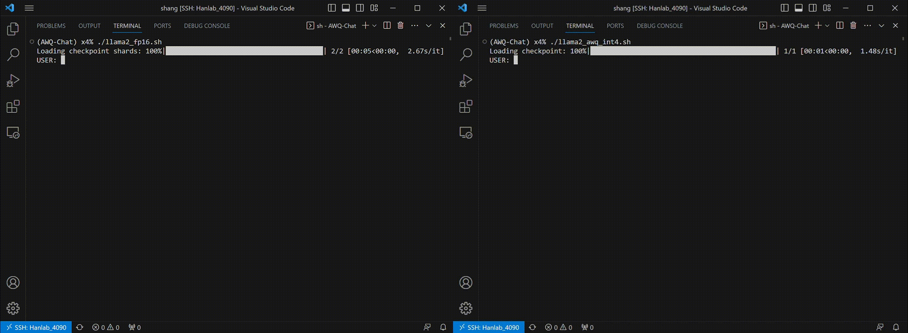

# TinyChat: Efficient and Lightweight Chatbot with AWQ

We introduce TinyChat, a cutting-edge chatbot interface designed for lightweight resource consumption and fast inference speed on GPU platforms. It allows for seamless deployment on consumer-level GPUs such as 3090/4090 and low-power edge devices like the NVIDIA Jetson Orin, empowering users with a responsive conversational experience like never before.

The current release supports:

- Llama-3-8B/70B-instruct;

- VILA-1.5-3B/8B/13B/40B;

- VILA-7B/13B;

- LLaVA-7B/13B;

- Llama-2-7B/13B-chat;

- Vicuna;

- MPT-chat;

- Falcon-instruct.

## Contents

- [Examples](#examples)

- [Benchmarks](#benchmarks)

- [Usage](#usage)

- [Reference](#reference)

## Examples

**Thanks to AWQ, TinyChat can now deliver more prompt responses through 4-bit inference. The following examples showcase that TinyChat's W4A16 generation is up to 3.7x faster on RTX 4090 and 3.3x faster on Jetson Orin, compared to the FP16 baselines. (Tested with [LLaMA-2-7b]( https://huggingface.co/meta-llama/Llama-2-7b-chat-hf ) model.)**

* TinyChat on RTX 4090 (3.4x faster than FP16):



* TinyChat on Jetson Orin (3.2x faster than FP16):


**TinyChat also supports inference with visual language models (e.g., VILA, LLaVA). In the following examples, W4A16 quantized models from VILA family are launched with TinyChat.**

* TinyChat with VILA-13B on RTX 4090 (multi-image inputs supported):


* TinyChat with VILA-7B/13B on Jetson Orin:


* TinyChat with video captioning:

https://github.com/Efficient-Large-Model/VILA/assets/156256291/c9520943-2478-4f97-bc95-121d625018a6

**Prompt:** Elaborate on the visual and narrative elements of the video in detail.

**Caption:** The video shows a person's hands working on a white surface. They are folding a piece of fabric with a checkered pattern in shades of blue and white. The fabric is being folded into a smaller, more compact shape. The person's fingernails are painted red, and they are wearing a black and red garment. There are also a ruler and a pencil on the surface, suggesting that measurements and precision are involved in the process.

**Online demo:** https://vila.hanlab.ai 

## Speed Benchmarks

We benchmark TinyChat on A6000 (server-class GPU), 4090 (desktop GPU) and Orin (edge GPU).

We use the default implementation from Huggingface for the FP16 baseline. The INT4 implementation applies AWQ and utilizes our fast W4A16 GPU kernel. We also apply additional optimization techniques in the latest release. For example, we fuse all the operations in MHA/GQA/MQA into a single kernel, and fuse positional embedding kernels into the attention kernel. We also pre-allocate key-value caches to avoid the online memory allocation overhead from Huggingface.

The latency reported in all tables are per-token latency for the generation stage.

### A6000 Results

| Model       | FP16 latency (ms) | INT4 latency (ms) | Speedup |
| ----------- |:-----------------:|:-----------------:|:-------:|
| LLaMA-3-8B  | 24.95             | 10.68             | 2.34x   |         
| LLaMA-2-7B  | 22.75             | 8.71              | 2.61x   |
| LLaMA-2-13B | 41.72             | 14.64             | 2.85x   |
| Vicuna-7B   | 22.03             | 8.39              | 2.63x   | 
| Vicuna-13B  | 38.97             | 13.46             | 2.90x   |
| MPT-7B      | 22.79             | 7.99              | 2.85x   |
| MPT-30B     | OOM               | 28.15             | --      |  
| Falcon-7B   | 39.44             | 11.71             | 3.37x   |
| VILA-7B     | 23.60             | 8.14              | 2.90x   |
| VILA-13B    | 46.58             | 13.74             | 3.39x   |

### 4090 Results

| Model       | FP16 latency (ms) | INT4 latency (ms) | Speedup |
| ----------- |:-----------------:|:-----------------:|:-------:|
| LLaMA-3-8B  | 17.07             | 6.66              | 2.56x   |
| LLaMA-2-7B  | 16.17             | 6.02*             | 2.68x   |
| LLaMA-2-13B | OOM               | 10.35             | --      |
| Vicuna-7B   | 15.81             | 5.33              | 2.97x   |
| Vicuna-13B  | OOM               | 9.17              | --      |
| MPT-7B      | 17.09             | 6.18              | 2.77x   |
| MPT-30B     | OOM               | 20.60             | --      |
| Falcon-7B   | 29.91             | 8.02              | 3.73x   |
| VILA-7B     | 17.09             | 5.95              | 2.87x   |
| VILA-13B    | OOM               | 10.01             | --      |

*: The reason why LLaMA-2-7B is slower than Vicuna-7B is because we need a longer prompt (with > 500 tokens) to prevent the model from talking with itself. If we use the benchmarking strategy from exLLaMA (i.e. only 4 context tokens), our speed is around 195 tokens / second.

### Orin Results

| Model       | FP16 latency (ms) | INT4 latency (ms) | Speedup |
| ----------- |:-----------------:|:-----------------:|:-------:|
| LLaMA-3-8B  | 96.24             | 32.55             | 2.96x   |
| LLaMA-2-7B  | 86.80             | 32.14*            | 2.70x   | 
| LLaMA-2-13B | OOM               | 58.20             | --      |
| Vicuna-7B   | 84.77             | 30.73             | 2.76x   |
| Vicuna-13B  | OOM               | 54.98             | --      |
| MPT-7B      | 89.85             | 31.22             | 2.88x   |
| Falcon-7B   | 147.84            | 45.10             | 3.28x   |
| VILA-7B     | 86.95             | 28.09             | 3.10x   |
| VILA-13B    | OOM               | 57.14             | --      |

*: We can similarly achieve 33 tokens / second on Orin if we use the benchmarking strategy from exLLaMA.

## Accuracy Evaluation

We recently evaluated AWQ's performance on the Visual Language Models. Here is a summary of VILA results.

| VILA-1.5-3B   | VQA-v2            | GQA               | VizWiz  | ScienceQA         | TextVQA           | POPE    | MME     | MMBench           | MMBench-CN    | SEED    |
| ----------- |:-----------------:|:-----------------:|:-------:|:-----------------:|:-----------------:|:-------:|:-------:|:-----------------:|:-------------:|:-------:|
| FP16        | 80.4  | 61.5 | 53.5   | 69.0  | 60.4  | 85.9 | 1442.4 | 63.4 | 52.7   | 60.9 |
| AWQ-INT4    | 80.0  | 61.1 | 53.8   | 67.8  | 60.4  | 85.9 | 1437.3 | 63.3 | 51.4   | 59.8 | 

| VILA-1.5-8B    | VQA-v2            | GQA               | VizWiz  | ScienceQA         | TextVQA           | POPE    | MME     | MMBench           | MMBench-CN    | SEED    |
| ----------- |:-----------------:|:-----------------:|:-------:|:-----------------:|:-----------------:|:-------:|:-------:|:-----------------:|:-------------:|:-------:|
| FP16        | 80.9  | 61.9 | 58.7   | 79.9  | 66.3  | 84.4 | 1577.01 | 72.3 | 66.2   | 64.2 |
| AWQ-INT4    | 80.3  | 61.7 | 59.3   | 79.0  | 65.4  | 82.9 | 1593.65 | 71.0 | 64.9   | 64.0 |

| VILA-1.5-13B    | VQA-v2            | GQA               | VizWiz  | ScienceQA         | TextVQA           | POPE    | MME     | MMBench           | MMBench-CN    | SEED    |
| ----------- |:-----------------:|:-----------------:|:-------:|:-----------------:|:-----------------:|:-------:|:-------:|:-----------------:|:-------------:|:-------:|
| FP16       | 82.8  | 64.3 | 62.6   | 80.1  | 65.0  | 86.3 | 1569.55 | 74.9 | 66.3   | 65.1 |
| AWQ-INT4    | 82.7  | 64.5 | 63.3   | 79.7  | 64.7  | 86.7 | 1531.35 | 74.7 | 66.7   | 65.1 |


| VILA-1.5-40B    | VQA-v2            | GQA               | VizWiz  | ScienceQA         | TextVQA           | POPE    | MME     | MMBench           | MMBench-CN    | SEED    |
| ----------- |:-----------------:|:-----------------:|:-------:|:-----------------:|:-----------------:|:-------:|:-------:|:-----------------:|:-------------:|:-------:|
| FP16      | 84.3  | 64.6 | 62.2   | 87.2  | 73.6  | 87.3 | 1726.82 | 82.4 | 80.2   | 69.1 |
| AWQ-INT4   | 84.1  | 64.4 | 61.3   | 86.7  | 73.2  | 88.2 | 1714.79 | 83.2 | 79.6   | 68.9 | 


## Usage

1. Please follow the [AWQ installation guidance](https://github.com/mit-han-lab/llm-awq#readme) to install AWQ and its dependencies.

2. Download the pretrained instruction-tuned LLMs:
   
   - For LLaMA-2-chat, please refer to [this link](https://huggingface.co/meta-llama/Llama-2-7b-chat-hf);
   
   - For Vicuna, please refer to [this link](https://huggingface.co/lmsys/);
   
   - For MPT-chat, please refer to [this link](https://huggingface.co/mosaicml/mpt-7b-chat);
   
   - For Falcon-instruct, please refer to [this link](https://huggingface.co/tiiuae/falcon-7b-instruct).

3. Quantize instruction-tuned LLMs with AWQ:
- We provide pre-computed AWQ search results for multiple model families, including LLaMA, OPT, Vicuna, VILA, and LLaVA. To get the pre-computed AWQ search results, run:

```bash
# git lfs install  # install git lfs if not already
git clone https://huggingface.co/datasets/mit-han-lab/awq-model-zoo awq_cache
```

- You may run a one-line starter below:

```bash
./scripts/llama2_demo.sh
```

Alternatively, you may go through the process step by step. We will demonstrate the quantization process with LLaMA-2. For all other models except Falcon, one only needs to change the `model_path` and saving locations. For Falcon-7B, we also need to change `q_group_size` from 128 to 64.

- Perform AWQ search and save search results (we already did it for you):

```bash
mkdir awq_cache
python -m awq.entry --model_path /PATH/TO/LLAMA2/llama-2-7b-chat \
    --w_bit 4 --q_group_size 128 \
    --run_awq --dump_awq awq_cache/llama-2-7b-chat-w4-g128.pt
```

- Generate real quantized weights (INT4):

```bash
mkdir quant_cache
python -m awq.entry --model_path /PATH/TO/LLAMA2/llama-2-7b-chat \
    --w_bit 4 --q_group_size 128 \
    --load_awq awq_cache/llama-2-7b-chat-w4-g128.pt \
    --q_backend real --dump_quant quant_cache/llama-2-7b-chat-w4-g128-awq.pt
```

4. Run the TinyChat demo:

```bash
cd tinychat
python demo.py --model_type llama \
    --model_path /PATH/TO/LLAMA2/llama-2-7b-chat \
    --q_group_size 128 --load_quant quant_cache/llama-2-7b-chat-w4-g128-awq.pt \ 
    --precision W4A16
```

Note: if you use Falcon-7B-instruct, please remember to also change `q_group_size` to 64. You may also run the following command to execute the chatbot in FP16 to compare the speed and quality of language generation:

```bash
python demo.py --model_type llama \
    --model_path /PATH/TO/LLAMA2/llama-2-7b-chat \
    --precision W16A16
```

The above command works well for most cloud and desktop GPUs, since their CPU and GPU memory space are separated. However, for edge GPUs with shared host and device memory, in order to run larger models (e.g. LLaMA-2-70B on 64GB Orin), it is necessary to break down the pretrained checkpoints into small pieces:

```bash
python split_ckpt.py --input_path quant_cache/llama-2-7b-chat-w4-g128-awq.pt \
    --output_path quant_cache/llama-2-7b-chat-w4-g128-awq
```

Then, to run the demo, one can use the following command. The only changes compared with the demo command above are: 

- We modify the `load_quant` argument;

- We introduce another flag `mem_efficient_load`.

```bash
cd tinychat
python demo.py --model_type llama \
    --model_path /PATH/TO/LLAMA2/llama-2-7b-chat \
    --q_group_size 128 --load_quant quant_cache/llama-2-7b-chat-w4-g128-awq \ 
    --precision W4A16 --mem_efficient_load
```

5. (Optional) Run the benchmark script:

```bash
cd tinychat
python benchmark.py --model_type llama \
    --model_path /PATH/TO/LLAMA2/llama-2-7b-chat    \
    --q_group_size 128
```

Note: The kv caches in the current implementation are pre-allocated. So if you run out of memory, it might be the case that the kv cache is too large. To solve the problem, you may pass in `--max_seq_len [a smaller number]`.

### Support Visual Language Models (VILA-1.5, VILA, LLaVA)

Our TinyChat also supports visual language models. Follow the instructions below to run VLMs on your own devices!

Step 1-3 are same as the deployment for Language-only models.

1. Follow the [AWQ installation guidance](https://github.com/mit-han-lab/llm-awq#readme) to install AWQ and its dependencies.

2. Download the pretrained VLMs (VILA).

3. Quantize the VLMs with AWQ and get the quantized checkpoint in `quant_cache`. We also provide a [sample script](../scripts/vila_example.sh) for this step.

4. Run the TinyChat demo for VLMs (with vlm_demo_new.py for VILA-1.5, vlm_demo.py for VILA and LLaVA):

```bash
cd tinychat
python vlm_demo_new.py \
    --model-path /PATH/TO/VILA/VILA-1.5-13B \
    --quant-path quant_cache/vila-1.5-13b-w4-g128-awq.pt \ 
    --precision W4A16 \
    --image-file /PATH/TO/INPUT/IMAGE \
    --vis-image #Optional
```

Alternatively, one may also skip the quantization process and directy download the quantized VILA-1.5 checkpoints from [here](https://huggingface.co/Efficient-Large-Model). Take VILA-1.5-13B as an example, after running:

```bash
cd tinychat
git clone https://huggingface.co/Efficient-Large-Model/VILA1.5-13b-AWQ
```

One may run:
```bash
python vlm_demo_new.py \
    --model-path VILA1.5-13b-AWQ \
    --quant-path VILA1.5-13b-AWQ/llm \ 
    --precision W4A16 \
    --image-file /PATH/TO/INPUT/IMAGE \
    --vis-image #Optional
```

to run the terminal demo directly.

Note: if you enable `--vis-image` mode, TinyChat will print input images directly in your terminal. You may need to install [termvisage](https://github.com/AnonymouX47/termvisage) to enable this mode. A [terminal emulator](https://github.com/AnonymouX47/termvisage?tab=readme-ov-file#requirements) is also required.

Note: VILA model family supports multi-image inputs. You can input multiple images in `/PATH/TO/INPUT/IMAGE` above, each image should be seperated by `,`.


## Reference

TinyChat is inspired by the following open-source projects: [FasterTransformer](https://github.com/NVIDIA/FasterTransformer), [FlashAttention](https://github.com/Dao-AILab/flash-attention), [vLLM](https://github.com/vllm-project/vllm), [FastChat](https://github.com/lm-sys/FastChat), [llama_cu_awq](https://github.com/ankan-ban/llama_cu_awq), [LLaVA](https://github.com/haotian-liu/LLaVA), [termvisage](https://github.com/AnonymouX47/termvisage).

